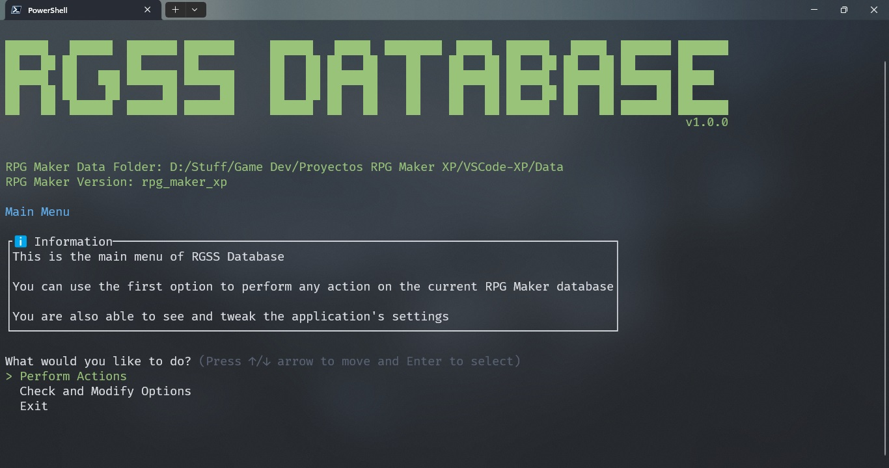
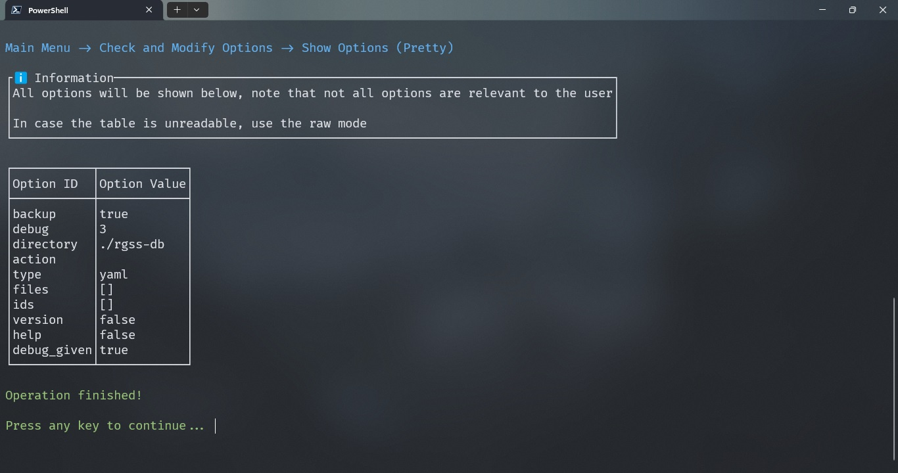
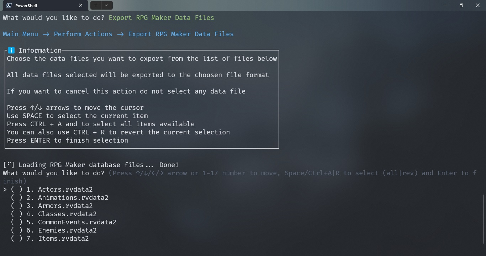
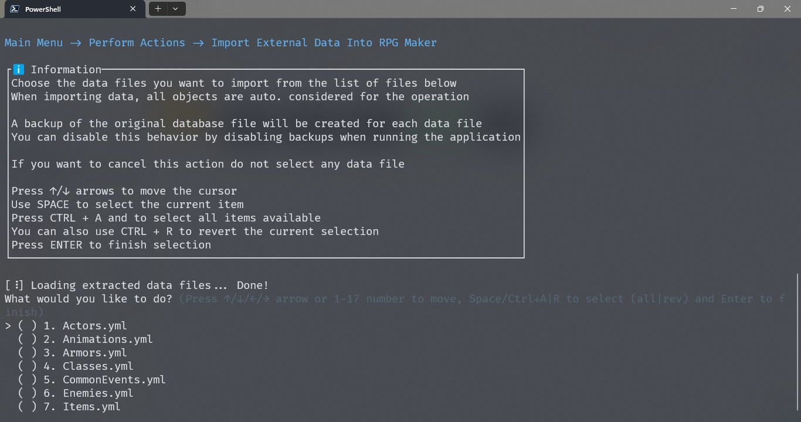

<p align="center">
    
</p>

<h1 align="center">RPG Maker Database Tool</h1>
<h3 align="center">This extension should be used for development purposes only!</h3>

## Table of contents

- [Table of contents](#table-of-contents)
- [Introduction](#introduction)
- [Features](#features)
- [Screenshots](#screenshots)
  - [Main Menu](#main-menu)
  - [Settings Menu](#settings-menu)
  - [Export Menu](#export-menu)
  - [Import Menu](#import-menu)
- [Requirements](#requirements)
- [Installation](#installation)
- [Usage](#usage)
  - [Command Syntax](#command-syntax)
  - [Basic Information](#basic-information)
    - [Skip CLI Menu](#skip-cli-menu)
  - [Options](#options)
    - [--debug](#--debug)
    - [--backup, --no-backup](#--backup---no-backup)
    - [-d, --directory](#-d---directory)
    - [-t, --type](#-t---type)
    - [-f, --files](#-f---files)
    - [-i, --ids](#-i---ids)
    - [-a, --action](#-a---action)
    - [-v, --version](#-v---version)
    - [-h, --help](#-h---help)
- [Known Issues](#known-issues)
- [Planned](#planned)
- [Contributing](#contributing)
- [License](#license)
- [Code of Conduct](#code-of-conduct)

## Introduction

RGSS Database is a tool designed for developers to export and import the database files of a game created in RPG Maker.

This gem is compatible with any RPG Maker editor based on RGSS, including:

- RPG Maker XP
- RPG Maker VX
- RPG Maker VX Ace

The purpose of this tool is to provide version control features on the RPG Maker database files if you are working on your game with a team and using any version control software.

Now, with JSON/YAML files you can actually see whats changed between versions on the database, something that was impossible with the RPG Maker binary format.

The only tool that does this that I know of is [rvpacker](https://github.com/ymaxkrapzv/rvpacker), but I haven't been able to get it to work and it doesn't seem to be maintained by anyone anymore, so I made my own tool for this.

Also, I have included some other cool features you may found useful!

List of all supported RPG Maker database files:

- Actors
- Animations
- Areas
- Armors
- Classes
- CommonEvents
- Enemies
- Items
- Map[001, 002, 003...]
- MapInfos
- Skills
- States
- System
- Tilesets
- Troops
- Weapons

The **Scripts database file is not supported** for
a few reasons:

- The format of the scripts database file is very different from the rest of the database files
  - The scripts database file is just a collection of ruby script files
  - These ruby script files depends (heavily) on a load order
    - If this load order does not persists between import and export operations, you will lose this order and (probably) cause a lot of troubles on your project
  - Script files can have duplicated names
    - This can cause problems if these scripts are extracted individually
  - Script file contents are compressed/decompressed
    - It would not be just "plug-and-play"
- Support for this database file would be very basic and limited
- **I have made a [Visual Studio Code extension](https://github.com/SnowSzn/rgss-script-editor) that handles this file much better than this application could do**
  - You can check out the features this VS Code extension offers on its repo.

## Features

- **Automatic detection of RPG Maker version**
  - The RPG Maker version will be automatically detected when opening the data folder
  - If the version cannot be determined, the application won't allow to perform any action to protect the data from corruption
- **Export RPG Maker database files**
  - You can export all your RPG Maker database files into human-readable data files
  - Supported file types:
    - JSON
    - YAML
  - Alternatively, you can export specific files and also, specific objects inside some database files
    - These files with custom objects are labeled like: Actors_custom, Items_custom...
  - You can also export objects into the binary format
    - The binary file format will be determined based on the RPG Maker version
- **Import Extracted data into RPG Maker**
  - You can import all your extracted data files into the RPG Maker editor
  - You can import custom data files that merge them with the current RPG Maker data
    - Any external data file created with specific objects
    - All objects will be appended at the end to avoid problems
  - **You must close the RPG Maker editor before importing data!**
    - RPG Maker cannot load data files again if it is already running
- **Backup Creation**
  - All your database data will be backed up everytime you import data into RPG Maker as a security measure
    - You can disable this behavior with a flag (see [options](#options))

## Screenshots

### Main Menu



### Settings Menu



### Export Menu



### Import Menu



## Requirements

- [Ruby v3.0+](https://www.ruby-lang.org/en/downloads/)
- [RPG Maker Editor](https://www.rpgmakerweb.com/)

## Installation

The gem is hosted at [RubyGems](https://rubygems.org/gems/rgss_db)

You can install this gem using the following command:

    $ gem install rgss_db

## Usage

### Command Syntax

```sh
rgss-db data_directory [options]
```

### Basic Information

You can simply use this tool by calling the rgss-db command and supplying a RPG Maker data path:

```sh
# Opens the current directory
rgss-db .
```

The path needs to be the data folder where all binary database files are stored, otherwise the app won't work.

This will open the application's menu where you can manually perform the desired action.

The application has a number of options that allow you to customize the behavior and output of the application, you can check more about this below.

#### Skip CLI Menu

You can use the `-a` (`--action`) flag to skip the application's CLI menu, this will perform the specified action and finish execution, see more at [-a, --action](#-a---action)

### Options

#### --debug

You can set the application's debug mode with the following option.

A log file will be created inside the application's working directory.

```sh
rgss-db . --debug 0 # Disables debug functionality (default)
rgss-db . --debug 1 # Enables debug error level
rgss-db . --debug 2 # Enables debug warning level
rgss-db . --debug 3 # Enables debug info level
```

#### --backup, --no-backup

You can enable/disable the automatic backup creation with these flags.

```sh
rgss-db . --backup      # Backups are created (default)
rgss-db . --no-backup   # Backups are not created
```

#### -d, --directory

Sets the application's working directory (used for exporting and importing)

All extracted files will be created inside this directory.

```sh
rgss-db . -d "./rgss-db"          # Data folder relative (default)
rgss-db . -d "C:/Absolute/Folder" # Absolute path
```

#### -t, --type

Sets the application's file format (used for exporting)

Supported file format types:

- YAML
- JSON
- BINARY

```sh
rgss-db . -t yaml   # Uses YAML format (default)
rgss-db . -t json   # Uses JSON format
rgss-db . -t binary # Uses Binary format
```

#### -f, --files

Sets a list of data files that will be affected by the action.

If not provided, it will consider all data files.

```sh
rgss-db . -f Actors.rvdata2 # Selects only the Actors file
rgss-db . -f Actors.json    # Selects only the Actors file
rgss-db . -f Actors.rxdata Items.rxdata
```

#### -i, --ids

Sets a list of objects that will be affected by an action (per data file)

This option only works for data files that supports this behavior:

- Actors
- Animations
- Areas
- Armors
- Classes
- CommonEvents
- Enemies
- Items
- MapInfos
- Skills
- States
- Tilesets
- Troops
- Weapons

This option can be repeated for each data file provided, meaning that if you use:

```sh
# Selects the Actors.rvdata2, Items.rvdata2 and Weapons.rvdata2 database files
rgss-db . -f Actors.rvdata2 Items.rvdata2 Weapons.rvdata2
```

You can use the `-i` option three times to specify the IDs for each file, in the same order they are in the `-f` option

```sh
# Object IDs received:
# - Actors.rvdata2  => [420, 123]
# - Items.rvdata2   => [73, 3, 7]
# - Weapons.rvdata2 => [69, 79, 89]
rgss-db . -f Actors.rvdata2 Items.rvdata2 Weapons.rvdata2 -i 420 123 -i 73 3 7 -i 69 79 89
```

#### -a, --action

You can skip the application's CLI menu completely if you supply a supported action.

The application will start and perform the action, using the given files and object IDs (if any) and close itself when the action finishes

These are the possible actions:

- `export`: Exports RPG Maker database
- `export_custom`: Exports specific objects from the RPG Maker database
- `import`: Imports external data into the RPG Maker database
- `import_custom`: Imports custom external data into the RPG Maker database (merge)

Here's a few examples with the action option **using the default application directory**:

```sh
# Opens the current directory and export all data
rgss-db . -a export

# Opens the current directory and import all data
rgss-db . -a import

# Opens the current directory and export only the Items file
rgss-db . -a export -f Items.rvdata2

# Opens the current directory and export only the object with ID: 100 from the Items file
rgss-db . -a export_custom -f Items.rvdata2 -i 100

# Opens the current directory and export only the object with ID: 100 from the Items file to a JSON file
rgss-db . -a export_custom -f Items.rvdata2 -i 100 -t json
```

#### -v, --version

Prints the application version and exit.

```sh
rgss-db -v
rgss-db --version
```

#### -h, --help

Prints a help message on the standard output and exit.

```sh
rgss-db -h
rgss-db --help
```

## Known Issues

- None

## Planned

- Code Maintenance
- Feature Requests

## Contributing

Bug reports and pull requests are welcome on GitHub at the [issue tracker](https://github.com/SnowSzn/rgss-db-cli/issues).

This project is intended to be a safe, welcoming space for collaboration, and contributors are expected to adhere to the [code of conduct](https://github.com/SnowSzn/rgss-db-cli/blob/main/CODE_OF_CONDUCT.md).

## License

The gem is available as open source under the terms of the [GNU General Public License version 3 License](https://opensource.org/license/gpl-3-0).

## Code of Conduct

Everyone interacting in the RGSS Database project's codebases, issue trackers, chat rooms and mailing lists is expected to follow the [code of conduct](https://github.com/SnowSzn/rgss-db-cli/blob/main/CODE_OF_CONDUCT.md).
